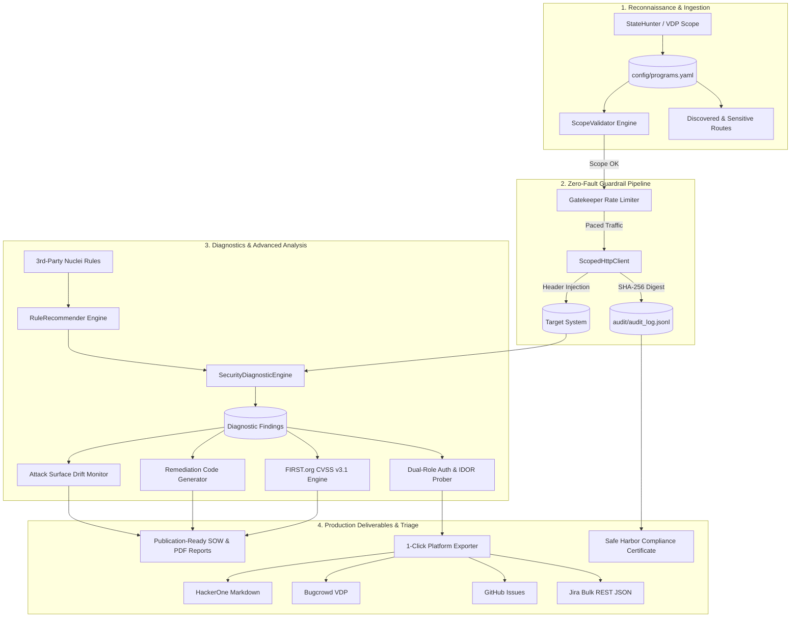

# AuditGuard

[](https://codeandcypher.com)
[](https://www.python.org/)
[](LICENSE)
[]()
[](docs/SAFE_HARBOR_LEGAL.md)
[](docs/ARCHITECTURE.md)
[](docs/rfcs/RFC-001-COMMUNITY-PEER-REVIEW.md)

> An open-source security engineering project by **[Code and Cypher](https://codeandcypher.com)**.  
> Authored by **Joshua A. Wortz, CISSP**.
>
> 📢 **Call for Peer Review**: We have published **[RFC-001: Community Peer Review](docs/rfcs/RFC-001-COMMUNITY-PEER-REVIEW.md)** and the accompanying technical paper **[Bridging the Browser-to-Boundary Gap](https://codeandcypher.com/posts/client-side-spa-recon-and-safe-harbor-verification/)**. We invite AppSec engineers, bug bounty researchers, and compliance architects to review our scope containment math and cryptographic audit ledgers.

**AuditGuard** is a pure Python 3.9+ standard library scope-containment engine and Disclose.io Safe Harbor audit logger built for authorized security assessments, penetration tests, and vulnerability disclosure programs (VDPs / bug bounty).

AuditGuard enforces deterministic boundaries on HTTP traffic, validates URLs against authorized targets and excluded paths before any network packet is transmitted, enforces token-bucket rate limits, maintains an immutable SHA-256 append-only ledger for legal safe harbor compliance, and generates reproducible triage reports.

### 🧪 Automated Test Suite (89/89 Passing)

AuditGuard includes a comprehensive test suite of **89 unit tests** verifying all core subsystems:

```powershell
# Run the full automated test suite
python -m unittest discover tests
```

Test coverage includes:
- Scope boundary enforcement (CIDR, wildcard hostnames, regex, excluded paths, and private IP blacklisting)
- Token-bucket gatekeeper rate limiting and interactive prompt controls
- Scoped HTTP client and append-only audit logging
- Cryptographic Proof-of-Adherence certificates (Disclose.io Safe Harbor)
- FIRST.org CVSS v3.1 score calculations and vector string synthesis
- Declarative YAML rule engine and discovery-driven rule recommendations
- Dual-role authorization matrix and IDOR / BOLA prober
- Attack surface drift and regression monitoring
- Statement of Work (SOW) reporting (Markdown, HTML, PDF) and platform triage export (HackerOne, Bugcrowd, GitHub, Jira)
- Git hygiene and exclusion rules for assessment artifacts

---

### Part of the Code & Cypher AppSec Suite
AuditGuard pairs with **[StateHunter](https://github.com/SixFiveMil/statehunter)** for full-lifecycle target analysis:
- **[StateHunter](https://github.com/SixFiveMil/statehunter)** (*Browser / Client-Side*): Discovers runtime SPA routes (Next.js, Angular, Remix), detects in-memory state secrets, and audits cross-origin `postMessage` handlers in real time.
- **[AuditGuard](https://github.com/SixFiveMil/auditguard)** (*Terminal / Server-Side*): Ingests StateHunter YAML exports (`auditguard import-scope`), enforces mathematical scope boundaries, audits route authorization matrices, and generates Safe Harbor-protected deliverables.

---

## Technical Architecture



---

## Core Capabilities

1. **Deterministic Scope Containment**: Strict matching against authorized target definitions (domain names, wildcards, CIDR blocks, explicit URLs). Blocks outbound requests to out-of-scope hosts, cloud metadata services (`169.254.169.254`), private IP ranges, and excluded paths (`/logout`, `/delete-account`, `/billing`).
2. **Rate Limiting & Traffic Pacing**: Token-bucket rate limiter enforcing configurable requests-per-second ceilings with interactive co-signing to prevent denial-of-service or server strain.
3. **Disclose.io Safe Harbor Audit Ledger**: Immutable append-only JSONL transaction log recording every outbound request, response metadata, timestamp, and SHA-256 hash. Generates cryptographic Proof-of-Adherence certificates aligning with Disclose.io Safe Harbor standards (CFAA 18 U.S.C. § 1030 / DMCA § 1201 research protections).
4. **StateHunter Scope Ingestion**: Directly ingests passive reconnaissance YAML exports (`*scope*.yaml`), classifying discovered SPA/API endpoints and isolating sensitive administrative routes.
5. **Declarative Nuclei-Compatible Diagnostics**: Native Python execution of declarative YAML diagnostic templates without external Go dependencies. Automatically filters and recommends safe, read-only templates matching target tech stacks.
6. **Deterministic FIRST.org CVSS v3.1 Scoring**: Pure-Python implementation of the official FIRST.org CVSS v3.1 metric specification, producing base scores, exploitability/impact subscores, and vector strings.
7. **Dual-Role Authorization Matrix & IDOR Auditing**: Evaluates access control differential between researcher-controlled identities (`user_a`, `user_b`, `admin`, unauthenticated) to detect Broken Object Level Authorization (`CWE-639`) and privilege escalation (`CWE-269`).
8. **Attack Surface Drift & Regression Monitoring**: Compares current target responses and security headers against baseline assessment sessions, highlighting new endpoints, status changes, and defensive regressions.
9. **Remediation & Statement of Work Reporting**: Exports publication-ready deliverables in Markdown, HTML, and PDF formats, with targeted code remediation snippets (Express, Nginx, Angular).
10. **Platform Triage Export**: Converts verified findings into submission-ready formats for **HackerOne**, **Bugcrowd (VRT-mapped)**, **GitHub Issues**, and **Jira (REST API JSON)**.

---

## Installation & Setup

AuditGuard requires Python 3.9 or newer. It can be installed as a standard CLI tool:

### Standard Installation
```powershell
# Clone the repository
git clone https://github.com/SixFiveMil/auditguard.git
cd auditguard

# Install dependencies and AuditGuard CLI
pip install .
```

### Development / Editable Installation
```powershell
pip install -e .
```

Once installed, the `auditguard` command is available directly in your terminal:
```powershell
auditguard --help
```

---

## Quickstart: Auditing OWASP Juice Shop

AuditGuard includes a pre-configured profile for testing against a local OWASP Juice Shop instance on `http://localhost:3000`.

### 1. View Active Scope & Rules of Engagement
```powershell
auditguard scope
```

### 2. Verify Target URL Scope Offline
```powershell
auditguard check http://localhost:3000/administration   # PASS: In scope
auditguard check http://localhost:3000/logout           # BLOCKED: Excluded critical path
auditguard check http://malicious-domain.com            # BLOCKED: Out of scope
```

### 3. Run Batch Endpoint Diagnostics & Export Deliverables
```powershell
auditguard audit-endpoints --flagged-only --yes --output reports/assessment.html --pdf reports/assessment.pdf
```

### 4. Export Platform Triage Reports
Generate ready-to-file submissions for HackerOne, Bugcrowd, GitHub, and Jira:
```powershell
auditguard export-triage --session audit/latest_findings.json --output-dir reports/triage
```

### 5. Probe for BOLA / IDOR Across Accounts
```powershell
auditguard audit-auth --url http://localhost:3000/administration --yes
```

### 6. Monitor Attack Surface Drift & Regressions
```powershell
auditguard monitor --baseline-session audit/latest_findings.json --live --yes
```

### 7. Inspect Safe Harbor Proof-of-Adherence Certificate
```powershell
auditguard safe-harbor
```

---

## CLI Command Matrix

| Subcommand | Description | Example |
|:---|:---|:---|
| `scope` | Display active program scope boundaries and rules | `auditguard scope` |
| `check` | Test a URL against scope rules without sending traffic | `auditguard check <url>` |
| `probe` | Send an authorized, rate-limited HTTP probe | `auditguard probe <url> -X GET -y` |
| `diagnose` | Run deep security diagnostics on a single endpoint | `auditguard diagnose <url>` |
| `audit-endpoints` | Run batch diagnostics across discovered routes | `auditguard audit-endpoints --flagged-only --yes` |
| `audit-auth` | Execute comparative authorization matrix / IDOR prober | `auditguard audit-auth -u <url> --yes` |
| `recommend-rules` | Auto-match 3rd-party rules based on detected technology | `auditguard recommend-rules --repo <path> --import` |
| `rules` | Query and inspect declarative YAML diagnostic rules | `auditguard rules --tag cors` |
| `retest` | Run targeted differential re-tests on prior defects | `auditguard retest -s audit/latest_findings.json -y` |
| `monitor` | Track attack surface drift and security regressions | `auditguard monitor --live --yes` |
| `export-triage` | Export findings to HackerOne, Bugcrowd, GitHub, Jira | `auditguard export-triage -s <session_id>` |
| `export-sow` | Export formal Statement of Work (PDF, HTML, MD) | `auditguard export-sow -o sow.pdf` |
| `export-report` | Export markdown bug bounty report from an audit entry | `auditguard export-report -i <req_id> -t "CORS Flaw"` |
| `safe-harbor` | Verify Safe Harbor Proof-of-Adherence Certificate | `auditguard safe-harbor` |
| `search-programs` | Search 800+ public bug bounty program registry | `auditguard search-programs gitlab` |
| `harvest-scope` | Passively harvest scope via security.txt and CT logs | `auditguard harvest-scope example.com` |
| `import-scope` | Ingest StateHunter scope YAML into configuration | `auditguard import-scope scope.yaml -a` |
| `endpoints` | Inspect discovered routes against active scope rules | `auditguard endpoints --flagged-only` |
| `logs` | View recent entries from the immutable audit ledger | `auditguard logs -n 10` |

---

## Incorporating 3rd-Party & Community Rules

AuditGuard supports querying, filtering, and importing declarative rules from external repositories (such as ProjectDiscovery Nuclei community templates):

```powershell
# 1. Clone community templates
git clone --depth 1 https://github.com/projectdiscovery/nuclei-templates.git D:/repos/nuclei-templates

# 2. Auto-match templates against target technology stack and import safe rules
auditguard recommend-rules --repo "D:/repos/nuclei-templates/http" --import
```

For full details on authoring custom rules, Safe Harbor verb filtering, and Windows Defender false-positive handling, see the [3rd-Party YAML Rules Guide](docs/THIRD_PARTY_RULES.md).

---

## Detailed Documentation Guides

- [3rd-Party & Community YAML Rules Guide](docs/THIRD_PARTY_RULES.md): Cloning, querying, and authoring declarative diagnostic templates.
- [Technical Architecture Specification](docs/ARCHITECTURE.md): Deep dive into the guardrail pipeline, CVSS v3.1 algorithms, and authorization math.
- [CLI Reference Manual](docs/CLI_REFERENCE.md): Comprehensive reference of all 20 CLI subcommands, flags, options, and sample outputs.
- [Safe Harbor Legal Protections Guide](docs/SAFE_HARBOR_LEGAL.md): Disclose.io legal alignment, CFAA/DMCA research protections, and Proof-of-Adherence certificates.

---

## Author & Research

AuditGuard is authored and maintained by **Joshua A. Wortz, CISSP** at [Code & Cypher](https://codeandcypher.com) — practical research, offensive tooling, and compliance automation for modern web applications.

* Website & Research: [https://codeandcypher.com](https://codeandcypher.com)
* GitHub: [@SixFiveMil](https://github.com/SixFiveMil)

---

## License

AuditGuard is licensed under the [MIT License](LICENSE).
