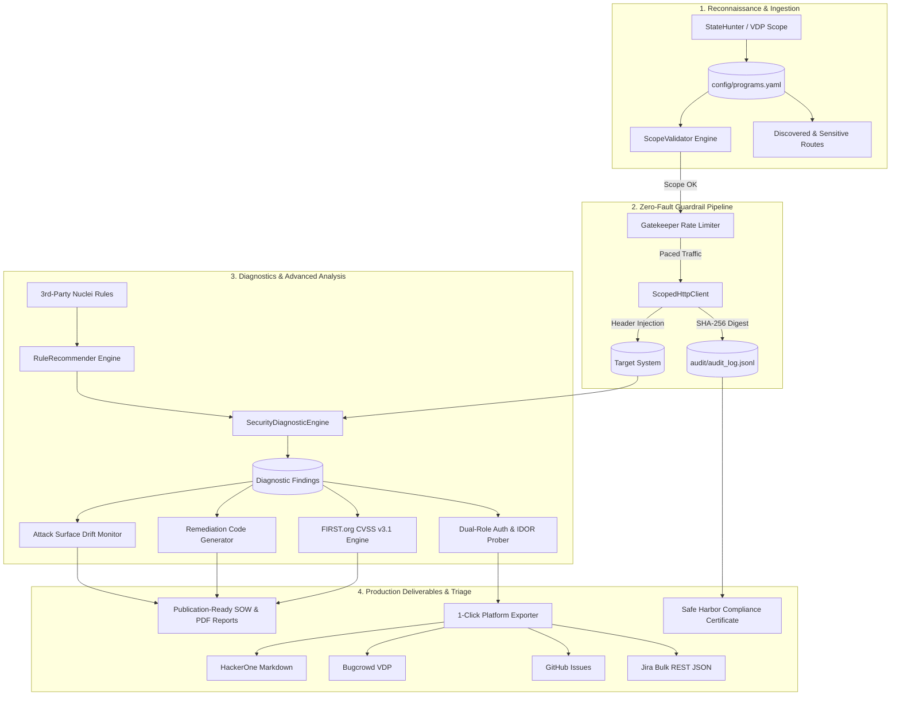

# AuditGuard

[](https://codeandcypher.com)
[](https://www.python.org/)
[](LICENSE)
[]()
[](docs/SAFE_HARBOR_LEGAL.md)
[](docs/ARCHITECTURE.md)

> An open-source security engineering project by **[Code and Cypher](https://codeandcypher.com)**.  
> Authored by **Joshua A. Wortz, CISSP**.

**AuditGuard** is an enterprise-grade, compliance-first security research automation and scope management framework designed for professional ethical hackers, penetration testers, and application security teams operating under Vulnerability Disclosure Programs (VDPs) and bug bounty platforms (HackerOne, Bugcrowd, Intigriti).

AuditGuard mathematically prevents out-of-scope network traffic, enforces token-bucket rate limits, automates discovery-driven diagnostics with declarative Nuclei-compatible YAML rules, calculates exact FIRST.org CVSS v3.1 scores, synthesizes copy-pasteable code patches, and exports 1-click triage reports.

### 🛡️ Part of the Code & Cypher AppSec Suite
AuditGuard pairs directly with **[StateHunter](https://github.com/SixFiveMil/statehunter)** to provide end-to-end vulnerability discovery and verification:
- **[StateHunter](https://github.com/SixFiveMil/statehunter)** (*Browser / Client-Side*): Discovers runtime SPA routes (Next.js, Angular, Remix), detects in-memory state secrets, and audits cross-origin `postMessage` handlers in real time.
- **[AuditGuard](https://github.com/SixFiveMil/auditguard)** (*Terminal / Server-Side*): Ingests StateHunter's YAML exports (`auditguard import-scope`), enforces mathematical scope boundaries, audits route authorization matrices, and generates Safe Harbor-protected deliverables.

---

## Technical Architecture



---

## The 10 Core Pillars of AuditGuard

1. **Deterministic Scope Enforcement**: Full regex, CIDR, and wildcard matching against in-scope targets. Mathematically prevents unauthorized outbound requests to external hosts, cloud metadata services (`169.254.169.254`), and prohibited critical routes (`/logout`, `/delete-account`, `/billing`).
2. **Human-in-the-Loop Gatekeeper & Pacing**: Token-bucket rate limiter enforcing policy ceilings (e.g. `2.0 req/s`) with interactive operator co-signing to prevent denial-of-service.
3. **StateHunter Reconnaissance & Route Auditing**: Direct ingestion of passive reconnaissance scope exports (`*scope*.yaml`), categorizing routes and isolating flagged administrative endpoints.
4. **Declarative Nuclei-Compatible YAML Diagnostics**: Native Python execution of open-source ProjectDiscovery Nuclei HTTP templates without external Go dependencies. Automatically recommends and filters safe, read-only templates matching target tech stacks.
5. **Deterministic FIRST.org CVSS v3.1 Scoring**: Pure-Python calculation of official FIRST.org base scores, exploitability/impact subscores, and RFC-compliant vector strings (`CVSS:3.1/...`) for every defect.
6. **Tech-Stack Tailored Code Remediation**: Automatically generates production-ready developer code patches (Node.js/Express, Nginx, Angular) for CORS, CSP, cache hygiene, and RBAC guards.
7. **1-Click Platform Triage Exporter**: Formats findings for instant submission to **HackerOne**, **Bugcrowd (VRT-mapped)**, **GitHub Issues**, and **Jira Cloud/Server (REST API JSON)**.
8. **Dual-Role Authorization Matrix & IDOR / BOLA Prober**: Safely probes comparative access across researcher-controlled accounts (`user_a` vs. `user_b` vs. `admin` vs. `unauth`) to detect Broken Object Level Authorization (`CWE-639`) and privilege escalation (`CWE-269`).
9. **Continuous Attack Surface Drift & Regression Monitor**: Compares target route state and defense headers against baseline sessions, detecting newly exposed endpoints, status transitions, and security regressions.
10. **Legal Safe Harbor Defense Engine & Retest SOW Reporting**: Full alignment with the **Disclose.io Core Vulnerability Disclosure Standard**. Evaluates the append-only ledger to issue cryptographic Proof-of-Adherence certificates (CFAA 18 U.S.C. § 1030 / DMCA § 1201 research protections).

---

## Installation & Setup

AuditGuard can be installed as a global or virtualenv CLI tool:

### Standard Installation
```powershell
# Clone the repository
git clone https://github.com/SixFiveMil/auditguard.git
cd auditguard

# Install dependencies and AuditGuard CLI
pip install .
```

### Development / Editable Installation
```powershell
pip install -e .
```

Once installed, the `auditguard` command is available directly in your terminal:
```powershell
auditguard --help
```

---

## Quickstart: Auditing OWASP Juice Shop

AuditGuard includes a pre-configured profile for testing against a local OWASP Juice Shop instance on `http://localhost:3000`.

### 1. View Active Scope & Rules of Engagement
```powershell
auditguard scope
```

### 2. Verify Target URL Scope Offline
```powershell
auditguard check http://localhost:3000/administration   # PASS: In scope
auditguard check http://localhost:3000/logout           # BLOCKED: Excluded critical path
auditguard check http://malicious-domain.com            # BLOCKED: Out of scope
```

### 3. Run Batch Endpoint Diagnostics & Export Deliverables
```powershell
auditguard audit-endpoints --flagged-only --yes --output reports/assessment.html --pdf reports/assessment.pdf
```

### 4. Export 1-Click Platform Triage Reports
Generate ready-to-file submissions for HackerOne, Bugcrowd, GitHub, and Jira:
```powershell
auditguard export-triage --session audit/latest_findings.json --output-dir reports/triage
```

### 5. Probe for BOLA / IDOR Across Accounts
```powershell
auditguard audit-auth --url http://localhost:3000/administration --yes
```

### 6. Monitor Attack Surface Drift & Regressions
```powershell
auditguard monitor --baseline-session audit/latest_findings.json --live --yes
```

### 7. Inspect Safe Harbor Proof-of-Adherence Certificate
```powershell
auditguard safe-harbor
```

---

## CLI Command Matrix

| Subcommand | Description | Example |
|:---|:---|:---|
| `scope` | Display active program scope boundaries and rules | `auditguard scope` |
| `check` | Test a URL against scope rules without sending traffic | `auditguard check <url>` |
| `probe` | Send an authorized, rate-limited HTTP probe | `auditguard probe <url> -X GET -y` |
| `diagnose` | Run deep security diagnostics on a single endpoint | `auditguard diagnose <url>` |
| `audit-endpoints` | Run batch diagnostics across discovered routes | `auditguard audit-endpoints --flagged-only --yes` |
| `audit-auth` | Execute comparative authorization matrix / IDOR prober | `auditguard audit-auth -u <url> --yes` |
| `recommend-rules` | Auto-match 3rd-party rules based on detected technology | `auditguard recommend-rules --repo <path> --import` |
| `rules` | Query and inspect declarative YAML diagnostic rules | `auditguard rules --tag cors` |
| `retest` | Run targeted differential re-tests on prior defects | `auditguard retest -s audit/latest_findings.json -y` |
| `monitor` | Track attack surface drift and security regressions | `auditguard monitor --live --yes` |
| `export-triage` | Export findings to HackerOne, Bugcrowd, GitHub, Jira | `auditguard export-triage -s <session_id>` |
| `export-sow` | Export formal Statement of Work (PDF, HTML, MD) | `auditguard export-sow -o sow.pdf` |
| `export-report` | Export markdown bug bounty report from an audit entry | `auditguard export-report -i <req_id> -t "CORS Flaw"` |
| `safe-harbor` | Verify Safe Harbor Proof-of-Adherence Certificate | `auditguard safe-harbor` |
| `search-programs` | Search 800+ public bug bounty program registry | `auditguard search-programs gitlab` |
| `harvest-scope` | Passively harvest scope via security.txt and CT logs | `auditguard harvest-scope example.com` |
| `import-scope` | Ingest StateHunter scope YAML into configuration | `auditguard import-scope scope.yaml -a` |
| `endpoints` | Inspect discovered routes against active scope rules | `auditguard endpoints --flagged-only` |
| `logs` | View recent entries from the immutable audit ledger | `auditguard logs -n 10` |

---

## Incorporating 3rd-Party & Community Rules

AuditGuard supports querying, filtering, and importing declarative rules from external repositories (such as ProjectDiscovery Nuclei community templates):

```powershell
# 1. Clone community templates
git clone --depth 1 https://github.com/projectdiscovery/nuclei-templates.git D:/repos/nuclei-templates

# 2. Auto-match templates against target technology stack and import safe rules
auditguard recommend-rules --repo "D:/repos/nuclei-templates/http" --import
```

For full details on authoring custom rules, Safe Harbor verb filtering, and Windows Defender false-positive handling, see the [3rd-Party YAML Rules Guide](docs/THIRD_PARTY_RULES.md).

---

## Detailed Documentation Guides

- [3rd-Party & Community YAML Rules Guide](docs/THIRD_PARTY_RULES.md): Cloning, querying, and authoring declarative diagnostic templates.
- [Technical Architecture Specification](docs/ARCHITECTURE.md): Deep dive into the guardrail pipeline, CVSS v3.1 algorithms, and authorization math.
- [CLI Reference Manual](docs/CLI_REFERENCE.md): Comprehensive reference of all 20 CLI subcommands, flags, options, and sample outputs.
- [Safe Harbor Legal Protections Guide](docs/SAFE_HARBOR_LEGAL.md): Disclose.io legal alignment, CFAA/DMCA research protections, and Proof-of-Adherence certificates.

---

## Automated Test Suite

AuditGuard includes a comprehensive test suite of **89 unit tests** with 100% pass rate:

```powershell
# Run full automated test suite
python -m unittest discover tests
```

---

## 👨‍💻 Author & Research

AuditGuard is authored and maintained by **Joshua A. Wortz, CISSP** at [Code & Cypher](https://codeandcypher.com) — practical research, offensive tooling, and compliance automation for modern web applications.

* Website & Research: [https://codeandcypher.com](https://codeandcypher.com)
* GitHub: [@SixFiveMil](https://github.com/SixFiveMil)

---

## License

AuditGuard is licensed under the [MIT License](LICENSE).
