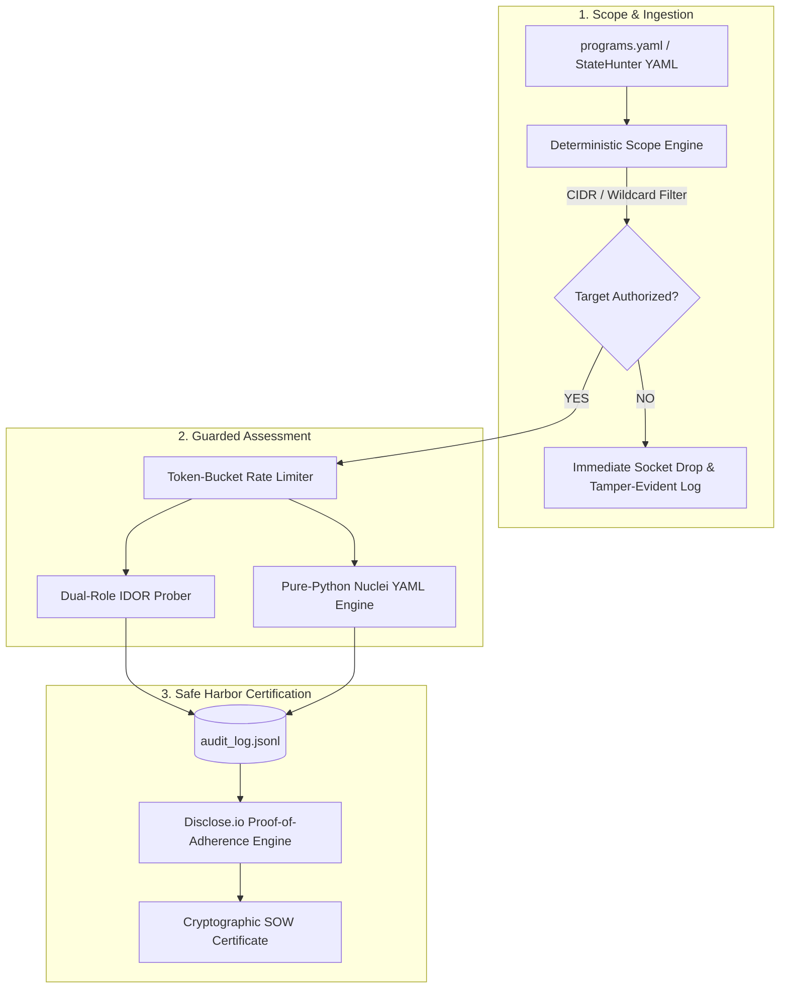

# RFC-001: Community Peer Review — Scope Containment Math, Pure-Python Nuclei & Legal Safe Harbor Ledger

- **RFC Identifier**: `RFC-001`
- **Title**: Architectural Peer Review for AuditGuard Scope Enforcement, Dual-Role Probing, and Safe Harbor Certification
- **Author**: Joshua A. Wortz, CISSP (Code and Cypher)
- **Status**: Open for Community Review
- **Created**: 2026-09-12
- **Related Technical Paper**: [Bridging the Browser-to-Boundary Gap: From Client-Side SPA State Reconnaissance to Safe Harbor Verification](https://codeandcypher.com/posts/client-side-spa-recon-and-safe-harbor-verification/)
- **Companion Project**: [StateHunter (Chrome DevTools Extension)](https://github.com/SixFiveMil/statehunter)

---

## 1. Executive Summary

**AuditGuard** is an open-source, zero-external-dependency (pure Python 3.9+ standard library) security assessment and compliance framework designed for authorized ethical hackers, penetration testers, and application security teams operating under Vulnerability Disclosure Programs (VDPs) and bug bounty engagements (HackerOne, Bugcrowd, Intigriti).

With the initial release of AuditGuard v1.0.0, we are opening our core design choices to adversarial peer review and community scrutiny. We invite application security engineers, cryptographers, legal compliance researchers, and bug bounty hunters to critique our models, stress-test our algorithms, and identify boundary edge cases.

---

## 2. Core Technical Components Under Review

### Pillar A: Deterministic Scope Containment Math
- **Mechanism**: Enforces program boundaries at the HTTP client transport layer using `ipaddress.ip_network` for CIDR blocks and regex trees for wildcards (`*.example.com`). Hardcodes link-local blocks (`169.254.169.254/32` cloud metadata) and loopback (`127.0.0.0/8`).
- **Review Question 1.1**: What edge cases exist in modern multi-cloud routing (e.g. AWS API Gateway custom domains, Cloudflare Workers, CNAME flattening) where legitimate in-scope traffic might be dropped, or prohibited endpoints might be incorrectly matched?
- **Review Question 1.2**: Are there DNS rebinding vectors that could bypass the initial hostname check between resolution and socket connection?

### Pillar B: Dual-Role Authorization Matrix (IDOR / BOLA CWE-639)
- **Mechanism**: Ingests parameterized route definitions from StateHunter (e.g. `/api/v1/patients/{id}/records`) and replays requests across two distinct researcher-controlled tokens (`user_a` vs `user_b`), computing status, length, and AST differential scores.
- **Review Question 2.1**: What statistical or semantic heuristics best eliminate false positives caused by anti-CSRF token rotation, session timestamps, or non-deterministic response fields without requiring full headless browser rendering?

### Pillar C: Pure-Python Declarative Nuclei Execution
- **Mechanism**: Interprets ProjectDiscovery Nuclei HTTP YAML diagnostic templates in pure Python using standard library modules, avoiding external Go binaries or network calls.
- **Review Question 3.1**: Are there complex matchers (e.g. DSL operators, multi-part binary conditions) in modern Nuclei templates that should be prioritized for standard library AST implementation?

### Pillar D: Legal Safe Harbor Proof-of-Adherence Certification
- **Mechanism**: Every outbound request, rate-limit event, and scope validation decision is written to an append-only JSONL ledger (`audit/audit_log.jsonl`). Upon assessment completion, AuditGuard hashes the ledger via SHA-256 and issues a Disclose.io Safe Harbor proof-of-adherence certificate under CFAA (18 U.S.C. § 1030) and DMCA (§ 1201) protections.
- **Review Question 4.1**: What cryptographic enhancements (e.g. hash-chaining previous entries, RFC 3161 trusted timestamping, or HMAC co-signing) would provide the strongest legal non-repudiation in the event of an attribution dispute with a program owner?

---

## 3. How to Submit Feedback & Contribute

We welcome all feedback, whether theoretical critiques or empirical findings:

1. **GitHub Issues**: Open an issue labeled `rfc-feedback` or `enhancement` at [github.com/SixFiveMil/auditguard/issues](https://github.com/SixFiveMil/auditguard/issues).
2. **GitHub Discussions**: Post your comments in the [RFC-001 Discussion Thread](https://github.com/SixFiveMil/auditguard/discussions).
3. **Pull Requests**: Submit edge-case test fixtures or code enhancements directly to `main`.
4. **Direct Research Contact**: Reach out via [codeandcypher.com/contact/](https://codeandcypher.com/contact/) or connect on [LinkedIn](https://linkedin.com/in/joshuawortz).

---
*AuditGuard is 100% free, open-source under the MIT License, and transmits zero telemetry.*
